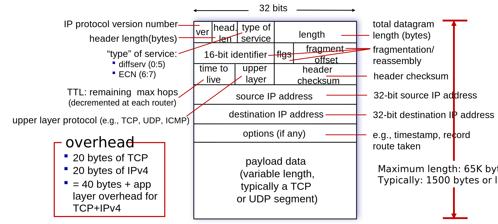

## Lesson Objectives  {data-background-image="/images/14-ipv4.png" data-background-opacity="0.1"}

1. Understand IPv4 datagram structure and header fields.
2. Describe IPv4 addressing: classes, subnetting, and CIDR notation.
3. Explain how DHCP assigns IP addresses dynamically.
4. Calculate subnet masks, number of hosts, network/broadcast addresses.

### Preparation

- $4.3.1$ IPv4 Datagram Format
- $4.3.2$ IPv4 Addressing

::: {.notes}
- Understand the structure of an IPv4 datagram, including its header fields and their purposes.
- Learn about IPv4 addressing, including the concept of classes, subnetting, and CIDR notation.
- Understand how Dynamic Host Configuration Protocol (DHCP) works to assign IP addresses dynamically to hosts in a network.
- Calculate subnet masks, determine the number of hosts in a subnet, and identify the network and broadcast addresses for a given IPv4 address and subnet mask.
:::

## IPv4 Datagram



# Addressing

## What is an IP Address?

- A 32-bit number that uniquely identifies each host interface on a network.
- Written in dotted-decimal notation, e.g. $192.168.100.200$
- Logical address - it can change!
- Assigned by network administrators or dynamically via DHCP.
- Can you assign it yourself?

## Network Interface

- 🔌 Connection point between a host and a physical link.

::: {.incremental}
- 🛣️ What about a router?
- 🖥️ Is a router also a host?
- 🔁 Can a host have multiple interfaces?
- 💻📶 How many actual physical interfaces does your laptop have?
:::

## Reading IPv4 Addresses

- Each octet represents 1 byte (8 bits) of the address
- Range: $0 \rightarrow (2^8 - 1) = 255$

::: {.hidden}
$$
 \def\eightblanks{{\_\space\_\space\_\space\_\space\_\space\_\space\_\space\_}}
 \def\fourtimeseightblanks{\eightblanks\cdot\eightblanks\cdot\eightblanks\cdot\eightblanks}
$$
:::

### $$199.239.136.245$$
### $$\fourtimeseightblanks$$
### $$192.168.100.1$$
### $$\fourtimeseightblanks$$

## Who is in charge of assigning IP addresses? [IANA](https://www.iana.org/numbers)


## Reserved Address Spaces

- Cannot be used on the public Internet
- Used for internal communication within private networks

::: {layout-ncol=2}
### Private Networks

- Class A: `10.0.0.0/8`
- Class B: `172.16.0.0/12`
- Class C: `192.168.0.0/16`

- Used with NAT to reach the Internet

### Special-Purpose Addresses

- Loopback: `127.0.0.0/8`
- Link-local: `169.254.0.0/16`
- Multicast: `224.0.0.0/4`
- Reserved: `240.0.0.0/4`
:::

## Where to find an IP Address?

::: {.incremental}
- 🔌 I just plugged in my laptop to the network.
- 🤔 How do I get an IP address?
- 🙋 Do I have to ask the network administrator for one?
- 🎲 Can I just assign myself one?
- 🚶 What if I move to a different network?
- 📋 Can someone just keep track of all the IP addresses and tell me which one to use?
:::

## Dynamic Host Configuration Protocol (DHCP)

### Messages: `DORA`
- `DISCOVER`: Who is in charge here of assigning IP addresses?
- `OFFER`: I am the DHCP server. Would you like `x.x.x.x`?
- `REQUEST`: Yes, I will take `x.x.x.x`
- `ACK`: Great, I will write that down. You have the lease for _86400 seconds_.

### Leases

- Time to live (TTL) for each assigned IP address
- Matches physical address (MAC address) to the logical address (IP address)
- Can be released or renewed; you can request the same one again

# Subnetting

## Broadcast Domain

- 💻 A group of devices that can communicate directly without a router
- 📣 Yelling: all devices receive broadcast messages sent by others
- ⚡ Direct communication is efficient
- ❓ Who broadcasts? ARP, DHCP etc.
- 🚧 Routers separate broadcast domains, so they do not forward broadcast traffic
- 🔊 Very noisy if the broadcast domain is too large
- ⚠️ Also very dangerous if not properly secured

## Subnet

- 🌐 Smaller portion of a larger network
- ✂️ Used to break up large IP spaces into smaller ones - reduce wastage
- 👥 Defined by people in charge of the network

$$200.23.20.0/24 = \underset{\text{NETWORK ADDRESS}}{\underline{11001000 \cdot 00010111 \cdot 00010100}} \cdot \underset{\text{HOST}}{\underline{00000000}}$$

::: {layout-ncol=2}
#### Network Address
- Reserved part of the address
- Same for all devices in the subnet
- Limits broadcast domain size
- Better security and performance

#### Host Portion / Part / Number / Identifier
- Remaining bits after the network prefix
- Unique to each device within the subnet
- Used to identify individual hosts
:::

## How many bits?

#### Classless Inter-Domain Routing (CIDR) Notation

$$\text{Network ID} = \underset{\text{NETWORK ADDRESS}}{\underline{10.22.128.0}} / \underset{\text{CIDR}}{\underline{22}} \rightarrow 10 \space \text{host bits}$$

#### Subnet Masks

- 32-bit number with a bunch of `1`s followed by a bunch of `0`s; matches CIDR notation
- Tells you how many bits are in the network vs host portions

$$\text{Network ID} = \underset{\text{NETWORK ADDRESS}}{\underline{00001010 \cdot 00010110 \cdot 100000}} \space \underset{\text{HOST}}{\underline{00 \cdot 00000000}}$$
$$\text{Subnet Mask} = \underset{\text{22 NETWORK BITS}}{\underline{11111111 \cdot 11111111 \cdot 111111}} \space \underset{\text{10 HOST BITS}}{\underline{00 \cdot 00000000}}$$

$$= 255.255.252.0$$

## How many hosts?

$$\text{Total Possible Addresses} = 2^{\text{Number of Host Bits}}$$

::: {layout-ncol=2}
#### Network Address
- Reserved for the subnet itself
- All host bits are `0`
- First address

#### Broadcast Address
- Send messages to all hosts in the subnet
- All host bits are `1`
- Last address
:::

$$\text{Usable Host Addresses} = \text{Total Possible Addresses} - 2$$

## Subnet Calculations

#### `200.23.20.0/24` = $\underline{11001000 . 00010111 . 00010100} . 00000000$
:::: {.columns}
::: {.column width=30%}
\# Host Bits:

\# Total:

\# Usable:
:::
::: {.column width=50%}
Broadcast Address:

First Host Address:

Last Host Address:
:::
::::

#### `200.23.20.0/23` = $\underline{11001000 . 00010111 . 0001010}0 . 00000000$
:::: {.columns}
::: {.column width=30%}
\# Host Bits:

\# Total:

\# Usable:
:::
::: {.column width=50%}
Broadcast Address:

First Host Address:

Last Host Address:
:::
::::

#### `200.23.20.0/25` = $\underline{11001000 . 00010111 . 00010100 . 0}0000000$
:::: {.columns}
::: {.column width=30%}
\# Host Bits:

\# Total:

\# Usable:
:::
::: {.column width=50%}
Broadcast Address:

First Host Address:

Last Host Address:
:::
::::

## Practice

Assigned network address space: `192.168.0.0/23`

Assign an appropriate address to each subnet.

```{dot width=100%}
//| fig-width: 16
//| fig-height: 5
graph Network {
    rankdir=LR;
    bgcolor="transparent"

    R1 [label="Router 1", shape=circle];
    R2 [label="Router 2", shape=circle];

    H1 [label="116 Hosts", shape=box3d];
    H2 [label="20 Hosts", shape=box3d];
    H3 [label="53 Hosts", shape=box3d];
    H4 [label="44 Hosts", shape=box3d];

    R1 -- R2 [label="2 Hosts"];
    H1 -- R1;
    H2 -- R1;
    R2 -- H3;
    R2 -- H4;
}
```

## Practice

Assigned network address space: `172.18.0.0/23`

Assign an appropriate address to each subnet.

```{dot width=100%}
//| fig-width: 16
//| fig-height: 5
graph Network {
    rankdir=LR;
    bgcolor="transparent"

    R1 [label="Router 1", shape=circle];
    R2 [label="Router 2", shape=circle];

    H1 [label="128 Hosts", shape=box3d];
    H2 [label="16 Hosts", shape=box3d];
    H3 [label="64 Hosts", shape=box3d];
    H4 [label="32 Hosts", shape=box3d];

    R1 -- R2 [label="2 Hosts"];
    H1 -- R1;
    H2 -- R1;
    R2 -- H3;
    R2 -- H4;
}
```
