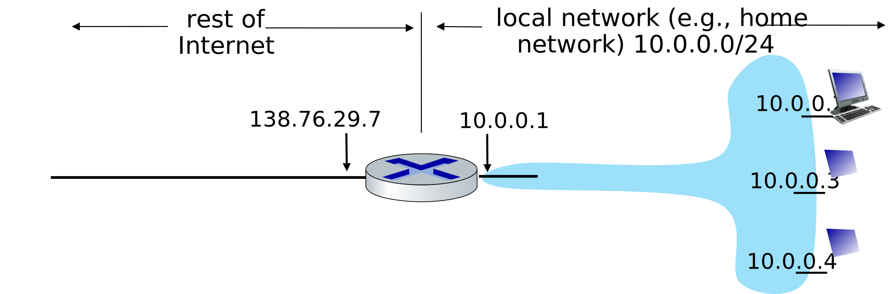
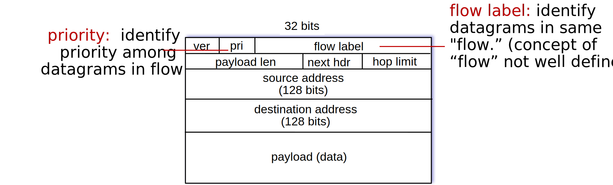

## Lesson Objectives  {data-background-image="/images/14-ipv4.png" data-background-opacity="0.1"}

1. Understand Network Address Translation (NAT) and the motivation for its use.
2. Describe the structure and features of IPv6.
3. Explain the different types of IPv6 addresses and their use cases.
4. Practice subnetting and address allocation (IPv4).

::: {.notes}
- Understand the concept of Network Address Translation (NAT) and its role in allowing multiple devices to share a single public IP address.
- Learn about the structure and features of IPv6, including its larger address space and improved header format.
- Understand the different types of IPv6 addresses (unicast, multicast, anycast) and how they are used.
:::

### Preparation

- $4.3.3$ Network Address Translation (NAT)
- $4.3.4$ IPv6

## The Problem

::: {.r-stack}
- IPv4 addresses are 32-bit long
- $2^{32} \approx 4.3$ billion addresses
- How many devices are connected to the Internet today?

{.fragment width="300"}
:::

## The Temporary Solution

#### Original Concept
- Every device needs a unique IP address to communicate on the Internet.

#### New Concept
- Give every device a unique ___private___ IP address.
- Make the entire network share one globally unique ___public___ address.

## The New Problem

- Devices with private IP addresses still need to communicate with devices outside the network.
- Messages from private network need to reach the correct device on the Internet.
- Messages from outside the network need to enter the private network and reach the correct device.

### This is familiar... how do messages find their way to the correct application on your computer?

---

::: {.r-fit-text}
Sockets!
:::

## Network Address Translation (NAT)

1. Laptop on the private network creates a packet destined for Server on the Internet and gives it to the nearest router.
1. Router changes the source IP address to the public IP address.
1. Router writes down the source port number and the private IP address of Laptop.
1. Router sends the packet to Server from another random source port number.
1. Server replies to the public IP address and the router's random source port number.
1. Router looks up the random source port number in its table, finds the private IP address and the source port number of Laptop.
1. Router changes the destination IP address to the private IP address and the destination port number to the source port number of Laptop.
1. Router sends the packet to Laptop.

## Network Address Translation (NAT)



---


::: {.r-fit-text}
The Real Solution = IPv6
:::

## How many addresses?

- $2^{128} = 340,282,366,920,938,463,463,374,607,431,768,211,456$ addresses
- Each grain of sand on Earth could have its own IP address!


## Internet Protocol version 6



### What changed since IPv4?

- No Checksum -> Much faster processing at routers
- No Fragmentation -> End hosts handle fragmentation and reassembly
- No Options -> Simplified header format with `next hdr` for extensions
- Every device can have a globally unique address -> No more NAT!

### Result? Efficiency!

### Missing: Fragmentation and Reassembly, Checksum, Options

## IPv6 Address Format

128 bits, represented in 8 colon-separated 16-bit hex chunks

$$\text{2001:0db8:85a3:0000:0000:8a2e:0370:7334}$$

Leading zeros can be omitted

$$\text{2001:db8:85a3:0000:0000:8a2e:370:7334}$$

A chunk of 4 zeros can be represented as a single zero

$$\text{2001:db8:85a3:0:0:8a2e:370:7334}$$

A run of zero chunks can be condensed into a double colon

$$\text{2001:db8:85a3::8a2e:370:7334}$$

## IPv6 Address Types

- $\text{::/128}$ = The unspecified address (all zeros). Used for software testing.
- $\text{::ffff:0:0/96}$ = IPv4 mapped address
- $\text{::1/128}$ = The loopback address (like $\text{127.0.0.1}$)
- $\text{ff00::/8}$ = Multicast address range (dst addr for subset of hosts)
- $\text{2001:db8::/32}$ = Documentation address, used for example purposes only
- $\text{fec0::/10}$ = Site-local prefix (like private addresses)
- $\text{fe80::/10}$ = Link-local prefix (also like private addresses)

## Subnetting Practice

Assigned network address space: `172.18.0.0/23`

Assign an appropriate address to each subnet.

```{dot width=100%}
//| fig-width: 16
//| fig-height: 5
graph Network {
    rankdir=LR;
    bgcolor="transparent"

    R1 [label="Router 1", shape=circle];
    R2 [label="Router 2", shape=circle];

    H1 [label="128 Hosts", shape=box3d];
    H2 [label="16 Hosts", shape=box3d];
    H3 [label="64 Hosts", shape=box3d];
    H4 [label="32 Hosts", shape=box3d];

    R1 -- R2 [label="2 Hosts"];
    H1 -- R1;
    H2 -- R1;
    R2 -- H3;
    R2 -- H4;
}
```
